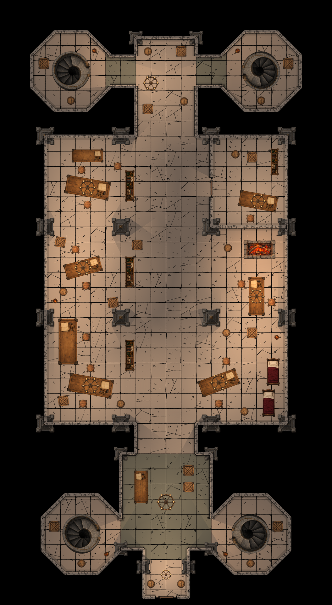

# 余烬秘库地下大厅：AI 素材绘图样例

[English drawing process](README.md)



本图通过 Dungeondraft MCP 绘制，家具使用 11 类从文字生成的透明素材，建筑使用软件原生地板、墙、门和灯光。采用**美观优先版**：适当放大家具，保持同类物件大小一致，给中央通道留出通行空间；不作为实际尺寸建筑图。

## 打开与使用

在 Dungeondraft 1.2.0.1 中打开 [原生地图](Embervault-Underhall-AI.dungeondraft_map)。无需额外素材包，11 张自生成素材已经嵌入地图，100 个物件仍可分别移动、缩放和调整图层。桌面纸张、工具画在桌子素材中，不能单独编辑；地板、墙、门和灯光是原生元素。手动打开地图不需要 MCP，自动检查需要启用桥接扩展。

- [无网格 PNG](Embervault-Underhall-AI.png)：2112 × 3840，每格 96 像素。
- [网格 PNG](Embervault-Underhall-AI-grid.png)：相同尺寸，显示网格。
- [素材与完整提示词](assets-manifest.json)：包含生成方式、透明边界裁切、导入尺寸及 SHA-256。
- [布局记录](layout.json)：物件坐标、类别尺寸、语义角色、地板轮廓、光源参数和会话空间区域。
- [检查记录](checks.json)：空间、通行、打包和保存重开结果。

## 绘制过程

1. **先规划建筑与动线。** 使用 22 × 40 格画布，每格对应 256 世界像素。中央大厅连通北侧储藏区、南侧秘库，四角八边形小室设置向下旋转楼梯。西侧楼梯入口朝东，东侧旋转 180°，上层平台朝向连接走廊；地图没有另外绘制下一层。工作、餐饮和睡眠区布置在主通道两侧。
2. **逐类生成透明素材。** 分别生成楼梯、桌子、圆凳、木桶、石柱、木箱、吊灯、床、火把、炉床和货架。英文提示词统一要求正上方俯视、透明背景、深色轮廓、旧木／青铜／灰石配色及物件外没有投影。生图没有输入第三方地图或素材。检查透明通道，按 alpha > 10 的边界裁切，再等比缩小至最长边 512 像素；只处理尺寸和透明留白，没有重绘图像。通过 `import_image` 导入成嵌入式图片物件。
3. **使用原生地板和建筑开口。** 用 `Level.FloorShapes.DrawPolygon` 绘制地板轮廓，明确选择原生 Smart Stone 的编号 1，再由 `Level.TileMap.AddRect` 填充。只删除地板自动生成的重复墙，保留预先规划开口的独立墙线。墙和两扇门使用软件内置石墙、木门素材。四角楼梯连接通道扩宽至两格。曾遇到选择贴图库后实际活动地板编号未更新，明确调用 `set_SmartTileId` 后解决。
4. **按家具类别与用途布置。** 同类圆凳、箱桶保持一致大小，不逐个随机缩放。桌子进入各功能区，凳子放在可使用的一侧，货架靠隔断，储物避开楼梯平台。家具位于 200 层、吊灯 300 层、石柱 400 层。石柱有意与建筑墙体相接；吊灯属于上方物件，不占地面通行面积。这些例外不适用于普通家具。
5. **检查整个占地轮廓。** 使用去除透明留白后的旋转矩形，检查墙体、房间边界、家具之间、门口净空和预留通道。首轮 12 个摆放被拒绝，随后重新摆放箱桶、床等物件；没有用关闭普通家具校验或单独缩小某个家具来掩盖问题。结构柱和吊灯的有意叠放使用明确角色，并在单独检查后允许。
6. **通过通行测试修正瓶颈。** 从南侧入口出发，以 0.125 格步长进行四邻接搜索，计算墙厚、打开的门洞和家具完整占地。直径 0.4 格的角色最初能够通行，但一格宽的战斗棋子发现三个目的地被堵。随后移动独立工作间桌子、邻近箱凳及右下餐桌组合，吊灯与光源随对应桌子一起移动。修正后，两种宽度都能到达全部 13 个目的地。楼梯测试目标是上层平台，不把楼梯井当作可穿过的平地。
7. **光源对应可见灯具。** 九盏吊灯、六支火把和一处炉火对应 16 个启用阴影的原生光源。环境光为 `#99918b`；吊灯 `#ffd09b`、亮度 0.65、范围 1.9～3.1；火把 `#ffba78`、亮度 0.45、范围 2.5；炉火 `#ffad65`、亮度 0.6、范围 2.3。范围是光照贴图缩放倍数，不是世界像素半径。初版叠加光照使地板过白，降低亮度后检查软件导出的实图。墙和高柱遮光，低矮家具不遮挡顶灯。这里使用软件的二维灯光，不能称为真实三维反平方光照模拟。
8. **保存重开与整理发布。** 重开原生地图，检查物件位置、大小、旋转、图层、两扇门和 16 个光源。把最初重复嵌入的 100 份图片整理为 11 张共享素材，保留 100 个独立物件。移除未使用的已安装素材包记录和地板查找表项，保留地图实际使用的全部地板编号。确认没有外部素材包引用、本机素材路径，再从软件导出最终无网格与网格 PNG，并检查成图。

## 尺寸与检查边界

`layout.json` 的 `long_tiles` 记录素材最长边的格数，使用的是技术裁切后的图像边界。圆凳和木桶统一为 0.55 格，木箱 0.7 格，床 1.85 格，楼梯 2.6 格；桌子按功能区采用 2.1～3.1 格的预设长度。结构柱和上方灯具采用适合所在建筑位置的尺寸。家具在缩小预览中仍清楚可辨，同时保留连续动线。

房间和净空区域是**会话数据**，重开原生地图后需要恢复。启用桥接扩展并打开此图后，在仓库已安装的 Python 环境中执行：

```powershell
python examples/embervault-ai/validate_live.py
```

脚本先核对地图尺寸和物件编号，再从布局记录恢复空间区域，检查物件变换、按角色区分的空间关系、两种宽度下的 13 个通行目标，以及 16 个光源，输出 `live-checks.json`。脚本不会重布置家具。保守矩形可能对凹形素材误报，有意的柱墙接触单独列出。本样例验证室内地图流程，没有覆盖地形、高度或软件全部功能。

本图还暴露了 MCP 的墙体编辑问题：调用原生 `Wall.Set` 会删除挂在墙上的门窗。修复后的 `modify_wall` 保留门窗物件及它们在墙段上的相对位置，随墙更新位置和方向；改变带门窗墙体的拓扑，或缩短到容不下门窗时，会在修改颜色、贴图之前拒绝。`tests/live_wall_portals.py --run-live` 使用独立测试图，验证门与窗的状态、朝向、安全拒绝及保存重开，结束后恢复先前打开的地图。

## 素材来源与使用

11 类自生成素材通过原生 ImageGen 从文字生成，附完整提示词与导入文件校验值。重新生成不会保证图像完全一致。自生成素材与样例辅助文件在适用版权范围内采用 [MIT](LICENSE)。软件内置美术仍属于原权利人，原生地图引用它们、成图包含其绘制结果；此目录没有将内置素材作为独立图片分发。Dungeondraft 的[官方 FAQ](https://dungeondraft.net/)允许发布原创地图，本样例不包含软件本体。
